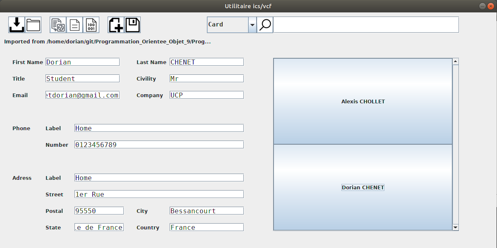

# Programmation_Orientee_Objet_L2S1
Ce projet a été réalisé dans le cadre du module d'introduction Programmation Orientee Objet L2S1 - Licence Informatique. Le but de ce logiciel est de pouvoir importer, gérer, modifier et exporter des fichiers au format csv à travers une interface graphique.

Consultez Rapport_POO.pdf pour les détails techniques. Ce dernier mentionne une interface en ligne de commandes mais elle n'est pas presente ici. 

Le dossier "fichiers test" contient quelques fichiers type pouvant être utilisés pour tester le logiciel.

Languages: Java + Java Swing (UI)

